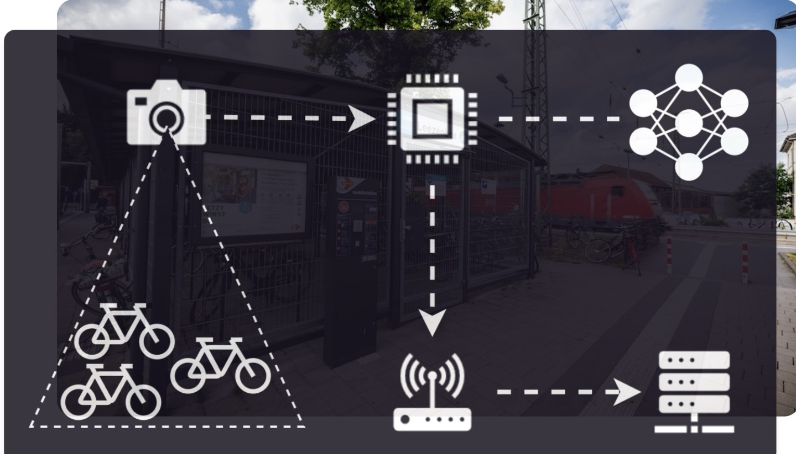

# Leezencounter



Leezencounter is a university project carried out by master students of the University of Münster, Germany, of the Information Systems Department at the chair Machine Learning and Data Engineering.

Within this project, microcontroller units (MCUs) were utilized in combination with quantized object detection models.

The goal of this project was to enable the real-time on-device bicycle detection in public spaces and transmit the bicycle detections via LoRaWAN to a web application. The web application provides a detailed overview of the occupancy statistics where the corresponding hardware is deployed.

Leezencounter is organized as a multi-component project (mono repository). See the [repository structure](#mono-repository-structure) for details.

# Hardware

We used the [XIAO ESP32-S3 Sense](https://wiki.seeedstudio.com/xiao_esp32s3_getting_started/) MCU with the [XIAO Wio-SX1262 LoRa module](https://www.seeedstudio.com/Wio-SX1262-with-XIAO-ESP32S3-p-5982.html). The default camera module of the ESP32-S3 was replaced by the OV5640 21mm 160 degrees one, which enabled the capturing of wider images and higher resolutions.

A custom 3D-printed case for the hardware was designed for mounting purposes.

# Software

The following software stack was used:

**Model Training**
- Python >=3.10
- [Ultralytics](https://docs.ultralytics.com/)
- [Weights & Biases](https://docs.wandb.ai/) (experiment tracking)
- [DVC](https://dvc.org/doc) (data and model versioning)
- [Digital Ocean](https://docs.digitalocean.com/) (S3-like cloud storage)

**Model Conversion & Deployment**
- [ESP-IDF](https://github.com/espressif/esp-idf) v5.5 (C/C++ project compilation and on-device application)
- [ESP-DL](https://github.com/espressif/esp-dl/tree/master) (on-device model inference)
- [ESP-PPQ](https://github.com/espressif/esp-ppq/tree/master) (model compression)
- Arduino

**Web Application**

Frontend: 
- Next.js 15.3.0
- Language: TypeScript 5
- Styling: TailwindCSS 4 with shadcn/ui components

Backend & Database:
- Runtime: Node.js with Next.js API Routes
- Database: PostgreSQL with pg driver

Infrastructure:
- Vercel Platform

**Sketches**
- Arduino IDE

A snapshot of the images used for model training can be found [here](https://uni-muenster.sciebo.de/s/7F6Wqp4oMBHok7K).

# Mono Repository Structure

```
.
├── model-training          // Experiments for model training and fine-tuning
│   ├── data                // training data
│   ├── model_training      // main directory containing experiment code
│   ├── models              // trained and loaded models
│   └── notebooks           // Jupyter notebooks for local experimentation
├── webapplication          // Webapp to display collected data
├── model-deployment        // Model deployment files for ESP32-S3
├── cad                     // CAD files for 3D-printable case
└── sketches                // Arduino Sketches for MCUs
```

Have a look at the sub-repository README files for more details.

# Project Building
The project workflow was as follows (if you want to re-produce the results or re-use this project for your purposes):

1. ``sketches`` (camera capture scripts) - Collect images
2. ``model-training`` - Train/Fine-tune model utilizing the images collected from `sketches` scripts
3. ``model-deployment`` (``model_conversion`` package) - Convert and compress the fine-tuned YOLO model
4. ``model-deployment`` (``yolo11_detect``) - Build the ESP-IDF project and deploy quantized model on hardware; send model predictions via BLE
5. ``webapplication`` - Setup web application for tracking collected data from MCUs
6. ``sketches`` (``lorawan_send`` package) - Receive model predictions via BLE and forward results via LoRaWAN to TNN node, which get fetched from the web application
7. (``cad`` - Use/Customize 3D-printable case (e.g., with [Tinkercad](https://www.tinkercad.com/)) to have an out-of-the-box usable mounting solution; optional)


# Licence
Leezencounter is licensed under the [GNU Affero General Public License v3.0](./LICENCE).

This project makes use of [Ultralytics](https://github.com/ultralytics/ultralytics),
which is licensed under the same terms.


# Contributing
Contributions are welcome! Please open issues or submit pull requests.

# Miscellaneous
Are you wondering what "Leezencounter" means? Have a look at our [trivia section in our wiki](https://github.com/SteffChef/Leezencounter/wiki).
